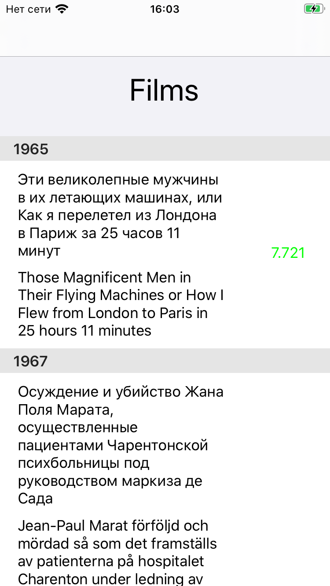
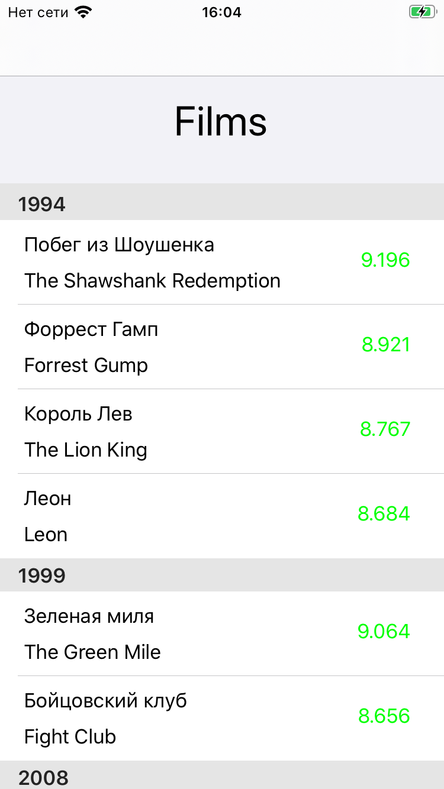
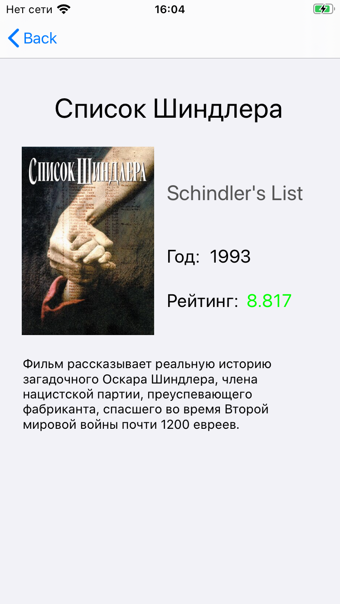

# Список фильмов
Мое первое полноценное приложение на **Swift**.

Основано на [тестовом задании](https://docs.google.com/document/d/1ZIkAFQGQzFYdDvyhlIGprqXMHCKz0Rkqk8XE3bjH9qA/edit) для собеседования.

  

  

Приложение представляет из себя список фильмов, полученных по запросу с сервера. Полученные **json** данные парсятся, сортируются **по году** и **рейтингу** фильма, и выводятся на экран. Когда пользователь выбирает фильм из списка, приложение переходит на экран с подробной информацией о выбранном фильме.
